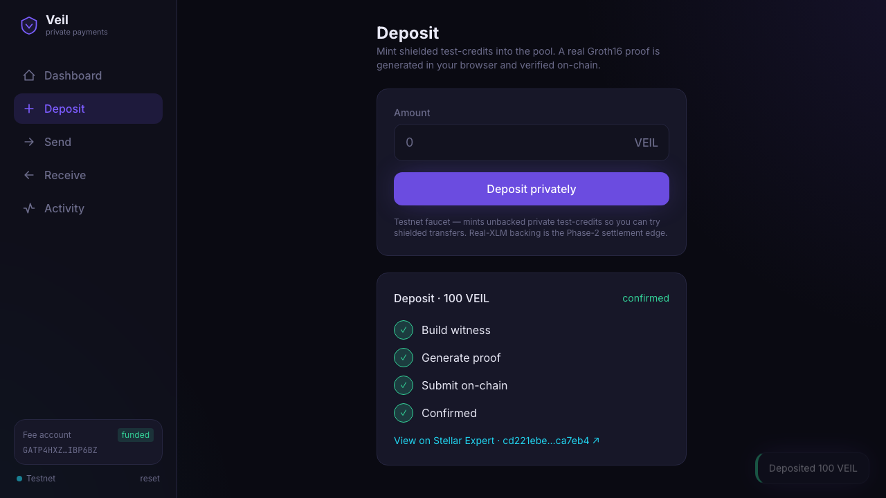

# Poof

Private Stellar testnet payments with Soroban, Groth16 proofs, and shielded notes.




Poof is a UTXO-style shielded pool for Stellar/Soroban. It keeps real testnet
assets in a Soroban contract while private notes appear on-chain only as
Poseidon commitments. A spend reveals nullifiers and a Groth16 proof, not the
spent note, owner, or amount.

> Research-grade software. Not audited. The trusted setup was generated by one
> local contributor. Do not put mainnet funds on this.

## Install

Prerequisites:

- Rust 1.93+ with the `wasm32v1-none` target
- Node.js 22+ and npm
- Circom 2.x for circuit rebuilds
- Stellar CLI for redeploying the contract

```bash
git clone git@github.com:ManulParihar/Poof.git
cd Poof
rustup target add wasm32v1-none

cargo fetch

cd circuits
npm install
cd ../app
npm install
cd ..
```

## Usage

Run the browser wallet against the current testnet deployment:

```bash
cd app
npm run dev
# Expected: Vite prints a local URL, usually http://localhost:5173
```

Run the full browser flow with real testnet transactions:

```bash
cd app
npm run e2e
# Expected: Playwright creates a wallet, deposits XLM, sends privately, withdraws.
```

Rebuild the circuit artifacts and prove a sample witness:

```bash
cd circuits
bash scripts/setup.sh
node test/transaction.test.js
node scripts/gen_sample_input.js
bash scripts/prove.sh build/sample_input.json
# Expected: snarkjs verifies the generated proof.
```

## Features

- Keep Stellar testnet assets in contract custody while wallet balances stay
  private.
- Spend notes with native Soroban BN254 Groth16 verification.
- Reject double spends through persistent nullifiers before state mutation.
- Preserve concurrency with a depth-20 incremental Merkle tree and 64-root
  history window.
- Add assets through an on-chain token registry without changing the circuit,
  verifying key, or contract wasm.
- Discover incoming notes through encrypted ciphertext events and view tags.
- Prove real wallet flows in the browser with `snarkjs` running in a Web Worker.

## Live Testnet

| Item | Value |
|---|---|
| Contract | [`CAJDD2WW3CCD37AO3UTRV56WZOVXOUDVBLB3UVNNVGZYBRHA6MRTVNX4`](https://stellar.expert/explorer/testnet/contract/CAJDD2WW3CCD37AO3UTRV56WZOVXOUDVBLB3UVNNVGZYBRHA6MRTVNX4) |
| Network | Stellar testnet |
| Merkle tree | depth 20, root history 64 |
| Currency 0 | XLM, native SAC `CDLZFC3SYJYDZT7K67VZ75HPJVIEUVNIXF47ZG2FB2RMQQVU2HHGCYSC` |
| Currency 1 | VUSD SAC `CDR3FXAKYZKDXMF53LZM5LIER7SYRKMA2EXGDBO3KODCCBEBCY5XJS64` |
| Genesis root | `2d3c07bea6883428edd2d80d07cec4b911309fed96743822d6aadea06313a951` |

See [`deploy/addresses.json`](deploy/addresses.json) for deployment metadata,
transaction hashes, and previous testnet contracts.

## Architecture

| Component | Path | Role |
|---|---|---|
| Crypto core | [`crates/poof-crypto`](crates/poof-crypto) | BN254 field encoding, circomlib-compatible Poseidon, note commitments, nullifiers |
| Circuit | [`circuits`](circuits) | 2-input/2-output Groth16 joinsplit with amount range checks and value conservation |
| Contract | [`crates/poof-contract`](crates/poof-contract) | Soroban authority for roots, nullifiers, token registry, settlement, and BN254 verification |
| SDK | [`crates/poof-sdk`](crates/poof-sdk) | Key derivation, note encryption, scanning, Merkle witnesses, and proof inputs |
| Indexer | [`indexer`](indexer) | SQLite-backed event ingestion and read API |
| Web App | [`app`](app) | Vite/React wallet for deposits, private sends, withdrawals, and browser proofs |

The critical invariant is that Poseidon is bit-identical in Rust, Circom, and
TypeScript. The pinned cross-implementation vectors live in
[`INTERFACES.md`](INTERFACES.md), [`crates/poof-crypto/tests/cross_impl.rs`](crates/poof-crypto/tests/cross_impl.rs),
and [`app/src/lib/crypto.test.ts`](app/src/lib/crypto.test.ts).

## API

Main contract calls:

- `init(admin, config, token)` seeds the tree and registers currency `0`.
- `register_token(token) -> u32` adds a new SAC-backed currency. Admin only.
- `transact(proof, public_signals, ext_data)` verifies a spend, settles public
  deposits or withdrawals, inserts output commitments, and emits events.
- `current_root()`, `is_known_root(root)`, `next_leaf_index()`, `is_spent(nf)`,
  `token_count()`, and `token(id)` expose wallet and indexer state.

Public signals are frozen in this order:

```text
[root, publicAmount, extDataHash, nf0, nf1, cm0, cm1, currencyId]
```

See [`INTERFACES.md`](INTERFACES.md) for byte encoding, event schemas,
`extDataHash`, note plaintext, and verifying-key layout.

## Test

Run the core verification gates:

```bash
cargo test -p poof-crypto
cargo test -p poof-contract --features mock-verifier
cargo test -p poof-contract
cargo test -p poof-sdk
cargo test -p poof-indexer
```

Run the wallet tests:

```bash
cd app
npm test
npm run build
npm run e2e
```

Run the ignored SDK proof test after circuit artifacts exist:

```bash
cargo test -p poof-sdk --test e2e_prove -- --ignored
```

## Deploy

Deploy a fresh testnet contract and register a second asset:

```bash
bash deploy/deploy_testnet.sh
```

The script funds a deployer through friendbot, builds optimized Soroban wasm,
initializes XLM as currency `0`, deploys a VUSD Stellar Asset Contract, and
registers it as currency `1`.

## Limits

- The circuit uses a single-contributor local powers-of-tau and zkey.
- Fee payers are visible on-chain, so relayers are still needed for submitter
  privacy.
- Small pools have small anonymity sets.
- The wallet scans recent RPC events; the indexer is the durable history path.
- This is testnet software and has not been audited.

## Contributing

Use the smallest gate that covers your change:

- Crypto or note math: `cargo test -p poof-crypto`
- Circuit changes: `cd circuits && node test/transaction.test.js`
- Contract state or settlement: `cargo test -p poof-contract`
- SDK witness, scan, or encryption code: `cargo test -p poof-sdk`
- Wallet changes: `cd app && npm test && npm run build`
- Browser flows: `cd app && npm run e2e`

Keep [`INTERFACES.md`](INTERFACES.md) in sync with any cross-component change.
Report bugs and design issues in GitHub issues.

## License

Apache-2.0. The workspace declares this in [`Cargo.toml`](Cargo.toml).
