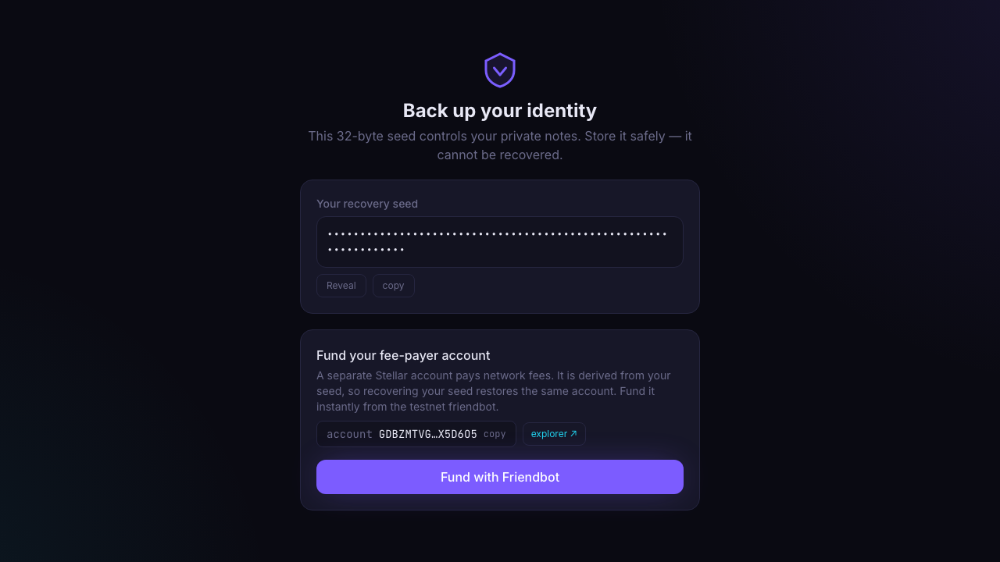
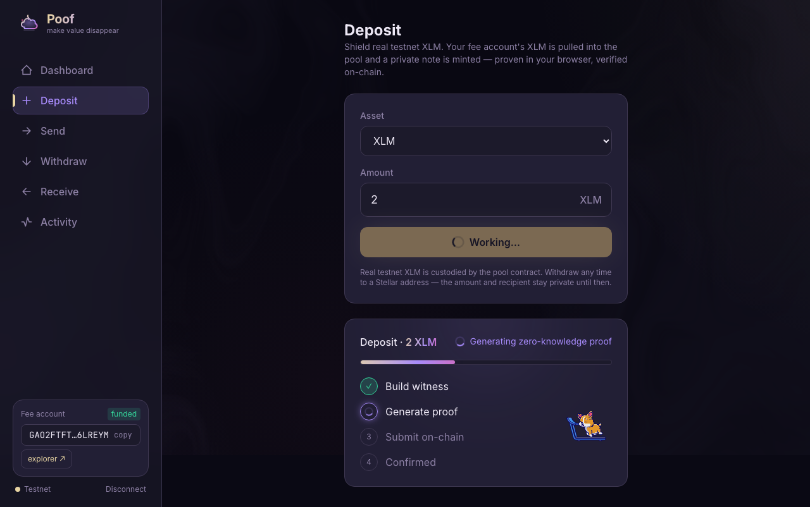
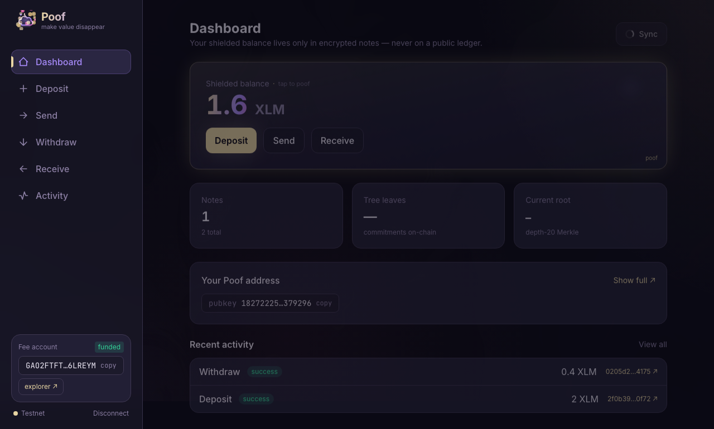

# Poof — make value disappear (the right way)

**Private payments on Stellar.** Deposit real testnet assets, send them so no one
can see the amount, the sender, or the receiver, and withdraw whenever you like.
The chain only ever sees math.


> **TL;DR** — Poof is a UTXO-style shielded pool for Stellar/Soroban. Your funds
> live in a Soroban contract; your balance lives only as Poseidon commitments on
> chain. Spending reveals a Groth16 proof and a nullifier — never the note, the
> owner, or the amount. Proofs are generated **in your browser**.

---

## Why Poof

Stellar is fast, cheap, and global — but every payment is also a public,
permanent broadcast of who paid whom and how much. Poof keeps the speed and the
real assets, and takes back the privacy.

- **🔒 Private by construction.** Amounts, senders, and recipients never touch
  the ledger. Notes appear only as commitments; spends prove validity without
  revealing anything spendable.
- **💸 Real assets, not play money.** Funds are held in a Soroban contract as
  actual testnet XLM (and any registered SAC asset like VUSD) — not an off-chain
  IOU.
- **🛡️ No double-spends, enforced on chain.** Every spend burns a persistent
  nullifier *before* state changes. The contract is the single source of truth.
- **🌐 Proofs in the browser.** `snarkjs` runs in a Web Worker — no trusted
  prover service, no backend signing your transactions, nothing to phone home.
- **➕ Add assets without touching the circuit.** An on-chain token registry
  onboards new currencies with zero changes to the proving key, verifying key,
  or contract wasm.
- **📬 Stealth delivery.** Incoming notes are discovered via encrypted ciphertext
  events and view tags — recipients scan, senders reveal nothing.

> ⚠️ **Research-grade software. Not audited.** The shipped trusted setup has a
> single local contributor. Great for a testnet demo — **do not put mainnet
> funds on this.**

---

## How it works (in plain English)

1. **Deposit.** You move real testnet assets into the Poof contract. In return,
   the contract records a *commitment* — a Poseidon hash of a secret note only
   you can open. The public ledger sees a deposit into the pool, nothing about
   your future balance.
2. **Send privately.** To pay someone, your browser builds a Groth16 proof that
   says *"I own valid notes worth X, I'm spending them correctly, and here are
   two fresh output commitments"* — without revealing the notes or amounts. The
   contract verifies the proof natively (BN254), burns the input nullifiers, and
   inserts the outputs into a depth-20 Merkle tree.
3. **Withdraw.** Prove ownership of a note and unlock the underlying asset back
   to any Stellar address. Public deposits/withdrawals settle the real SAC
   transfer; private transfers move only commitments.

The whole flow runs against the live testnet contract today — try it below.

---

## Privacy & payments features

Beyond the core shielded pool, the wallet ships a set of features that close real
privacy gaps and make it usable as an actual payments app:

- **🔗 Payment requests & links.** Share a `veil:` URI / QR that encodes your
  shielded meta-address plus an optional amount, asset and memo. The payer's wallet
  detects it and prefills the Send form — "Venmo, but shielded." Nothing in the link
  is spendable. (`app/src/lib/paymentLink.ts`, Receive → *Request payment*.)
- **👁 Selective disclosure.** Export a read-only **viewing key** (the encryption
  secret, never the spend key) so an auditor can replay the pool and see everything
  you *received* — without being able to spend. Generate **proof-of-payment
  receipts** that open a single note's Poseidon commitment so anyone can verify the
  exact value existed on-chain. (`app/src/lib/disclosure.ts`, *Disclosure* page.)
- **🛡 Anonymity-set meter.** Before every Send/Withdraw, see your pool size and how
  *buried* the funds you're spending are (commitments inserted after them), with a
  nudge to wait when a note was just deposited. (`app/src/lib/anonymitySet.ts`.)
- **🎲 Decoy booster.** One click runs randomized-delay self-transfers that fatten
  the pool and break the deposit→spend timing tell — balance unchanged.
  (`app/src/lib/decoy.ts`, *Privacy* page.)
- **🗓 Recurring payments.** Standing private transfers fire on an interval while the
  wallet is open — proved in your browser, no custodian. (`app/src/lib/schedule.ts`,
  *Scheduled* page.)
- **⚡ Gasless withdrawals (relayer).** A relayer submits your in-browser-proved
  withdraw and pays the Stellar network fee, compensated by an in-proof fee the
  contract pays it (recipient nets `amount − fee`). Closes the "fee-payer is public"
  leak — your destination never needs XLM. Both payout legs are bound into
  `extDataHash`, so the relayer can redirect neither. (`/relayer` service +
  `app/src/lib/relayer.ts`; needs the fee-settling contract — see below.)

> The first five work against the **live testnet contract** with no redeploy. The
> relayer's fee settlement is a contract change (`ExtData.relayer_address` + a
> withdraw fee split); activate it by redeploying (`bash deploy/deploy_testnet.sh`)
> and setting `VITE_RELAYER_URL` on the frontend. Until then the gasless toggle stays
> hidden and withdrawals self-submit exactly as before.

---

## See it in action

A real end-to-end run, captured straight from the [Playwright suite](app/e2e) —
create a wallet, deposit, prove in the browser, and withdraw. No mockups.

<table>
  <tr>
    <td width="33%" valign="top">
      <br/>
      <sub><b>1. Create a wallet</b><br/>A fresh shielded identity, seed, and Poof address.</sub>
    </td>
    <td width="33%" valign="top">
      <br/>
      <sub><b>2. Deposit &amp; prove</b><br/>The Groth16 proof is generated in a Web Worker — no prover service.</sub>
    </td>
    <td width="33%" valign="top">
      <br/>
      <sub><b>3. Shielded balance</b><br/>2 XLM held privately — visible to you, not the ledger.</sub>
    </td>
  </tr>
  <tr>
    <td width="33%" valign="top">
      <br/>
      <sub><b>4. Withdraw, confirmed</b><br/>Unlock the real asset back to any Stellar address.</sub>
    </td>
    <td width="33%" valign="top">
      <br/>
      <sub><b>5. Balance updates</b><br/>1.6 XLM left after a private spend — the chain only saw math.</sub>
    </td>
    <td width="33%" valign="top"></td>
  </tr>
</table>

---

## Try it in 60 seconds

**Prerequisites:** Rust 1.93+ (`wasm32v1-none` target), Node.js 22+, npm. Circom
2.x and the Stellar CLI are only needed if you rebuild circuits or redeploy.

```bash
git clone git@github.com:ManulParihar/Poof.git
cd Poof
rustup target add wasm32v1-none
cargo fetch

cd app && npm install
npm run dev
# Vite prints a local URL (usually http://localhost:5173). Open it and create a wallet.
```

That's it — the wallet talks to the **live testnet deployment** out of the box.
Want to watch the full happy path execute real on-chain transactions?

```bash
cd app
npm run e2e
# Playwright creates a wallet, deposits XLM, sends privately, and withdraws.
```

---

## Live testnet

| Item | Value |
|---|---|
| Contract | [`CDVNLQYWDDH4BJQJBIOWW2CJELVR62FGGVPQN3ZMUNS7PUCIWH3SBLPN`](https://stellar.expert/explorer/testnet/contract/CDVNLQYWDDH4BJQJBIOWW2CJELVR62FGGVPQN3ZMUNS7PUCIWH3SBLPN) |
| Network | Stellar testnet |
| Merkle tree | depth 20, root history 64 |
| Currency 0 | XLM, native SAC `CDLZFC3SYJYDZT7K67VZ75HPJVIEUVNIXF47ZG2FB2RMQQVU2HHGCYSC` |
| Currency 1 | VUSD SAC `CDR3FXAKYZKDXMF53LZM5LIER7SYRKMA2EXGDBO3KODCCBEBCY5XJS64` |
| Genesis root | `2d3c07bea6883428edd2d80d07cec4b911309fed96743822d6aadea06313a951` |

Full deployment metadata, transaction hashes, and previous contracts live in
[`deploy/addresses.json`](deploy/addresses.json).

---

## What's under the hood

| Component | Path | Role |
|---|---|---|
| Crypto core | [`crates/poof-crypto`](crates/poof-crypto) | BN254 field encoding, circomlib-compatible Poseidon, note commitments, nullifiers |
| Circuit | [`circuits`](circuits) | 2-input/2-output Groth16 joinsplit with amount range checks and value conservation |
| Contract | [`crates/poof-contract`](crates/poof-contract) | Soroban authority for roots, nullifiers, token registry, settlement, and BN254 verification |
| SDK | [`crates/poof-sdk`](crates/poof-sdk) | Key derivation, note encryption, scanning, Merkle witnesses, proof inputs |
| Indexer | [`indexer`](indexer) | Durable SQLite-backed event ingestion + read API (optional) |
| Relayer | [`relayer`](relayer) | Gasless-withdrawal service: submits a proved withdraw + pays the network fee (optional) |
| Web app | [`app`](app) | Vite/React wallet for deposits, private sends, withdrawals, and browser proofs |

**The invariant that makes it all work:** Poseidon is bit-identical across Rust,
Circom, and TypeScript. The pinned cross-implementation vectors live in
[`INTERFACES.md`](INTERFACES.md),
[`crates/poof-crypto/tests/cross_impl.rs`](crates/poof-crypto/tests/cross_impl.rs),
and [`app/src/lib/crypto.test.ts`](app/src/lib/crypto.test.ts). Break that and
everything else is theater.

### The contract API

- `init(admin, config, token)` — seeds the tree and registers currency `0`.
- `register_token(token) -> u32` — adds a new SAC-backed currency (admin only).
- `transact(proof, public_signals, ext_data)` — verifies a spend, settles public
  deposits/withdrawals, inserts output commitments, emits events.
- `current_root()`, `is_known_root(root)`, `next_leaf_index()`, `is_spent(nf)`,
  `token_count()`, `token(id)` — read-only state for wallets and indexers.

Public signals are frozen in this order:

```text
[root, publicAmount, extDataHash, nf0, nf1, cm0, cm1, currencyId]
```

See [`INTERFACES.md`](INTERFACES.md) for byte encoding, event schemas,
`extDataHash`, note plaintext, and verifying-key layout.

---

## Ship it: deployment

Poof is two deployables: a **static frontend** (no backend required) and an
**optional durable indexer** for long-term history.

### Frontend → Vercel

The app is a static SPA — it talks directly to Soroban RPC and friendbot and
generates proofs in the browser, so it drops onto Vercel with no servers to run.
[`app/vercel.json`](app/vercel.json) sets the build command, output directory,
and an SPA rewrite so deep links don't 404. Set the project root to `app/`.

Environment variables (both are `VITE_`-prefixed → bundled into the client):

```text
VITE_VUSD_FAUCET_SECRET = <secret from `stellar keys show poof-faucet`>   # required for the VUSD faucet
VITE_INDEXER_URL        = https://<your-indexer>.up.railway.app           # optional, see below
```

> The faucet secret is intentionally client-bundled — it's a **low-stakes
> testnet faucet distributor** key, not an admin or issuer. A leak only risks the
> faucet's testnet VUSD balance. **Never** put an admin/issuer key in a `VITE_`
> var.

### Indexer → Railway (recommended), Fly, or any container host

The wallet scans recent events straight from Soroban RPC, which only retains
~7 days of history. Once the contract is older than that window, new users can't
reconstruct the full tree from RPC alone. The [`indexer`](indexer) is the durable
fix: a long-running Rust poller that ingests every commitment/nullifier into
SQLite and serves them over a read API. It needs a persistent process and disk,
so it can't run on Vercel.

**Railway** is the path of least resistance — the repo ships
[`railway.json`](railway.json), a multi-stage [`Dockerfile`](Dockerfile), and a
step-by-step guide in [`deploy/RAILWAY.md`](deploy/RAILWAY.md):

1. Point Railway at this repo (root directory `/`) — it auto-detects
   `railway.json` + `Dockerfile`.
2. Add a **Volume mounted at `/data`** so the SQLite DB survives redeploys.
3. Set env vars: `POOF_CONTRACT_ID`, `POOF_DB_PATH=/data/poof-indexer.db` (RPC,
   poll interval, and log level have sane defaults).
4. Generate a public domain. The service binds to Railway's injected `$PORT`
   automatically — **don't** set `POOF_BIND`.

Prefer **Fly.io**? [`fly.toml`](fly.toml) is ready to go:

```bash
fly volumes create poofdata --size 1 --region iad
fly secrets set POOF_CONTRACT_ID=CDVNLQYWDDH4BJQJBIOWW2CJELVR62FGGVPQN3ZMUNS7PUCIWH3SBLPN
fly deploy
```

Either way it serves `GET /health`, `/notes`, `/nullifiers`, and `/tree/root`.
All config is env vars (`POOF_DB_PATH`, `POOF_RPC_URL`, `POOF_CONTRACT_ID`,
`POOF_POLL_SECS`, and `$PORT`/`POOF_BIND`); see
[`indexer/src/main.rs`](indexer/src/main.rs).

**Connecting the two:** set `VITE_INDEXER_URL` on the frontend to your indexer's
public URL. The wallet stays **RPC-first** and only falls back to the indexer
when RPC retention has aged out early history — and if the indexer is unset or
down, it silently keeps working on RPC alone. Zero risk, durable history when you
want it.

### Contract (redeploy)

```bash
bash deploy/deploy_testnet.sh
```

Funds a deployer through friendbot, builds optimized Soroban wasm, initializes
XLM as currency `0`, deploys a VUSD Stellar Asset Contract, and registers it as
currency `1`.

---

## Share & reproduce

Everything needed to run Poof is in this repo **except one file**: the proving
key `transaction.zkey` (~12 MB) is gitignored for size. There are no other
out-of-band secrets — the deployer identity lives only in your local
`stellar keys` keystore and is never needed to *run* the project against the live
contract.

The catch: `transaction.zkey` and the contract's on-chain verifying key must come
from the **same trusted setup** ("world"), or every proof fails with contract
error `#5`. Two share paths:

- **Use the live contract** — send the exact `app/public/circuit/transaction.zkey`
  that matches the deployed contract, then run the default bootstrap.
- **Run your own** — regenerate the setup and redeploy your own contract with
  `--fresh` (no zkey needed from anyone).

```bash
bash deploy/bootstrap.sh           # shared zkey + the live contract
bash deploy/bootstrap.sh --fresh   # regenerate setup, rebuild VK, redeploy a new contract
```

`bootstrap.sh` checks prerequisites, installs deps, (re)builds, runs the
integration gate proving the zkey matches the contract's world, and produces a
production build. `--fresh` additionally compiles the circuit, runs the setup,
syncs artifacts into the app, and redeploys — after which you update
`CONTRACT_ID` / `CONTRACT_START_LEDGER` in
[`app/src/lib/types.ts`](app/src/lib/types.ts) and
[`deploy/addresses.json`](deploy/addresses.json) with the printed values.

---

## Trusted setup ceremony

The shipped setup has a single local contributor — fine for testnet, not for
anything real. [`circuits/scripts/ceremony.sh`](circuits/scripts/ceremony.sh)
runs a multi-party Groth16 phase-2 ceremony, **sound as long as at least one
contributor destroys their entropy**. Contribution is sequential — each person
builds on the previous `.zkey`.

```bash
# Coordinator: produce the starting key
bash circuits/scripts/ceremony.sh init                     # -> contrib_0000.zkey (publish it)

# Each contributor, in turn, on their own machine:
bash circuits/scripts/ceremony.sh contribute <in.zkey> <out.zkey> <name>
# -> send <out.zkey> on; post the printed attestation hash publicly

# Coordinator, after the last contribution returns:
bash circuits/scripts/ceremony.sh finalize <last.zkey>     # -> transaction.zkey + verification_key.json
```

Intermediate `.zkey` files contain no secrets — distribute them however is
convenient; the attestation-hash chain is the public, auditable transcript. For a
public ceremony with strangers and a web UI, use a framework like p0tion.
**A finished ceremony is a new world — you must redeploy the contract
afterward** (the script prints the exact `export_vk_rust.js` +
`deploy_testnet.sh` steps).

---

## Test

Core verification gates:

```bash
cargo test -p poof-crypto
cargo test -p poof-contract --features mock-verifier
cargo test -p poof-contract
cargo test -p poof-sdk
cargo test -p poof-indexer
```

Wallet:

```bash
cd app
npm test
npm run build
npm run e2e
```

The ignored SDK proof test (after circuit artifacts exist):

```bash
cargo test -p poof-sdk --test e2e_prove -- --ignored
```

---

## Honest limits

- The circuit uses a single-contributor local powers-of-tau and zkey.
- Fee payers are visible on-chain for self-submitted txs. The optional **relayer**
  (`/relayer`) closes this for withdrawals — gasless, the destination never needs
  XLM — once the fee-settling contract is deployed and `VITE_RELAYER_URL` is set.
- Small pools mean small anonymity sets.
- The wallet scans recent RPC events; the indexer is the durable history path
  (wire it up via `VITE_INDEXER_URL`).
- This is testnet software and has not been audited.

---

## Contributing

Use the smallest gate that covers your change:

- Crypto / note math → `cargo test -p poof-crypto`
- Circuit changes → `cd circuits && node test/transaction.test.js`
- Contract state / settlement → `cargo test -p poof-contract`
- SDK witness, scan, or encryption → `cargo test -p poof-sdk`
- Wallet changes → `cd app && npm test && npm run build`
- Browser flows → `cd app && npm run e2e`

Keep [`INTERFACES.md`](INTERFACES.md) in sync with any cross-component change.
Report bugs and design issues in GitHub issues.

## License

Apache-2.0, declared in [`Cargo.toml`](Cargo.toml).
