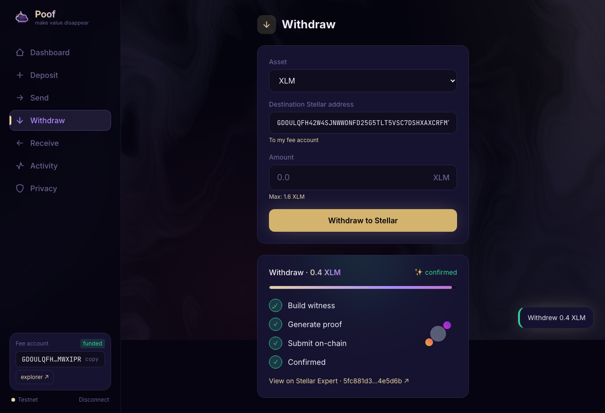

# Poof Wallet

A real web wallet for the Poof shielded pool. It generates **real Groth16 proofs
in the browser** and submits **real on-chain `transact` calls** to the deployed
Soroban contract — no mocks on the critical path.



## What it does
- **Create / import** a Poof identity (32-byte seed → key hierarchy).
- **Fund** a separate fee-payer Stellar account from the testnet friendbot.
- **Deposit** — mint shielded test-credits (publicAmount mint) with a real proof.
- **Send** — a private transfer with real Merkle membership; recipient + amount
  hidden, only an unlinkable nullifier + new commitments hit the chain.
- **Receive** — share your address (QR), discover incoming notes by view-tag
  trial-decryption.
- **Activity** — every tx with its live building→proving→submitting→confirmed
  stepper and a Stellar Expert link.

## Architecture
- **Vite + React + TS + Tailwind**, state in zustand (persisted).
- **`src/lib/crypto.ts`** — the browser's single source of note math:
  `circomlibjs` Poseidon (== circomlib == `poof-crypto`) + `@noble` (x25519,
  ChaCha20-Poly1305) + keccak. Verified bit-identical to the pinned vectors and
  the on-chain `extDataHash` in `src/lib/crypto.test.ts`.
- **`src/lib/witness.ts`** — deposit/transfer/withdraw witness builders.
- **`src/workers/prover.ts`** — `snarkjs.groth16.fullProve` in a Web Worker
  (artifacts served from `public/circuit/`).
- **`src/lib/proof.ts`** — formats the proof to the contract's bytes (G2 c1‖c0
  swap).
- **`src/lib/chain.ts`** — `@stellar/stellar-sdk` v16: ScVal-encoded `transact`
  submission, simulate reads, `getEvents` scanning.
- **`src/store/wallet.ts`** — orchestrates crypto → prove → submit.

## The integration gate
`src/lib/crypto.test.ts` + `src/lib/integration.test.ts` prove, in node, that
the browser crypto matches `poof-crypto`/the circuit and that a real deposit
witness proves & verifies. Run: `npm test`.

## End-to-end (real browser)
`e2e/wallet.spec.ts` (Playwright, headless Chromium) drives the real flow:
create → friendbot-fund → **deposit 100** (in-browser proof + on-chain) →
balance 100 → **private send 40 to self** (real Merkle-membership proof +
on-chain) → balance 60. Screenshots in `e2e/screenshots/`.

```bash
npm install
npm run build
npm run e2e        # real proofs + real testnet transactions
npm run dev        # http://localhost:5173
```

## Contract
`CBWUPNPVE2WQIZZETYPQTAGFQLYSDC3BWHAIE6QT7ZMIMAYYIUKPZZUM` on Stellar testnet
(see `../deploy/addresses.json`). The deposit/withdraw `publicAmount` is an
**unbacked testnet mint/burn**; the current flow uses real-XLM settlement.

## Real XLM
Deposit pulls **real testnet XLM** from your fee account into the pool contract;
withdraw releases it to any Stellar address. Value conservation is enforced
in-circuit; `settlement_address` is bound into `extDataHash` so a withdraw can't
be redirected. The pool's on-chain XLM custody always equals deposits − withdrawals.
E2E proven: deposit 2 XLM → withdraw 0.4 XLM, balance 2 → 1.6, real on-chain.

## Honest notes
- Amounts are in stroops (1 XLM = 10⁷); the fee-payer account is generated/stored
  in the browser (testnet only).
- Note discovery scans a recent RPC event window; the durable indexer
  is the answer for full history.
